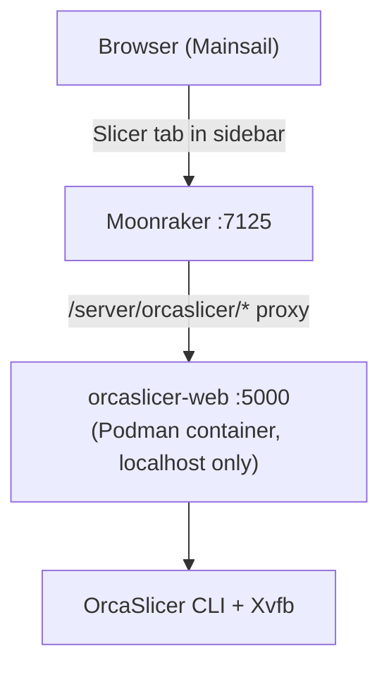

# Mainsail OrcaSlicer

Slice STL and 3MF files directly from Mainsail — no desktop slicer needed.

This is a **Moonraker component** (not a Mainsail fork) that adds OrcaSlicer integration to the Mainsail web interface. It uses [orcaslicer-web](https://github.com/zvakanaka/orcaslicer-web) under the hood and works with stock Mainsail — no custom build required. A "Slicer" tab appears in the Mainsail sidebar where you can upload profiles, drop in a model, and slice. The resulting GCODE lands in your G-Code Files list automatically.

> [!WARNING]
> This project is in early stages

## Architecture



- **No Mainsail fork** — uses Mainsail's custom navigation (`.theme/navi.json`)
- **No CORS issues** — the slicer UI is served by Moonraker itself (same origin)
- **No external dependencies** — the UI is a single self-contained HTML file

## Requirements

- **aarch64** (e.g. BIQU CB1, Raspberry Pi 4) or **x86_64** board running a Debian-based Linux
- Klipper + Moonraker + Mainsail (standard KIAUH install)
- Internet access (for initial container build)
- ~15 GB free disk space (32 GB eMMC recommended)

## Installation

SSH into your printer and run:

```bash
git clone https://github.com/zvakanaka/mainsail-orcaslicer.git ~/mainsail-orcaslicer
bash ~/mainsail-orcaslicer/install.sh
```

The installer handles everything:

1. Installs Podman (if missing)
2. Clones and builds the orcaslicer-web container
3. Starts the container on `127.0.0.1:5000` with a systemd user service
4. Symlinks the Moonraker component into place
5. Adds the `[orcaslicer]` section to `moonraker.conf`
6. Adds the "Slicer" entry to Mainsail's sidebar navigation
7. Restarts Moonraker and verifies everything is working

The script is idempotent — safe to re-run. It takes ~20-30 minutes in my experience.

## Usage

### 1. Export profiles from OrcaSlicer desktop

On your laptop/desktop, open OrcaSlicer and export your configured profiles:

- **Printer:** Printer menu > Export Printer Presets
- **Process:** Process menu > Export Preset
- **Filament:** Filament menu > Export Preset

Each produces a `.json` file.

### 2. Upload profiles

Open Mainsail and click **Slicer** in the sidebar. Use the profile tabs (Printer / Process / Filament) to upload each `.json` file.

### 3. Slice

1. Drop an STL or 3MF file onto the upload area
2. Select your printer, process, and filament profiles from the dropdowns
3. Click **Slice**
4. When complete, the GCODE appears in Mainsail's **G-Code Files** tab
5. Print as normal

## What gets installed

| Item | Location |
|------|----------|
| Podman | System package |
| orcaslicer-web source | `~/orcaslicer-web/` |
| Container image | Podman local storage |
| Profile data | `~/orcaslicer-profiles/` |
| Systemd user service | `~/.config/systemd/user/` |
| Moonraker component | Symlinked into Moonraker's components dir |
| moonraker.conf section | `~/printer_data/config/moonraker.conf` |
| Mainsail nav entry | `~/printer_data/config/.theme/navi.json` |

## Configuration

The `[orcaslicer]` section in `moonraker.conf`:

```ini
[orcaslicer]
orcaslicer_url: http://localhost:5000
request_timeout: 300
gcodes_path: ~/printer_data/gcodes
```

## Updates

An `[update_manager]` entry is added automatically. Updates appear in Mainsail's Update Manager alongside Klipper and Moonraker.

## Testing

`install.sh` and `uninstall.sh` are covered by a bats-core test suite that
mocks out `apt-get`, `podman`, `systemctl`, `loginctl`, `curl`, `sudo`, and
`git`, then runs the real scripts against a sandboxed `$HOME` to exercise
their actual logic (idempotency, moonraker-components detection, navi.json
merging, disk-space gating, etc.) without touching your system.

`src/orcaslicer.py` (the Moonraker component) is covered by a pytest suite
that imports the real source file into a minimal fake `moonraker` package
(`tests/pyunit/fakemoonraker`), so the proxy/validation/multipart logic runs
for real against mocked HTTP responses — no live Moonraker or orcaslicer-web
required.

`src/slicer_ui.html` (the frontend) is covered by a Playwright suite that
serves the real file statically and intercepts its `/server/orcaslicer/*`
calls, exercising the upload/slice/delete flows and button-gating logic in
an actual browser.

```bash
shellcheck install.sh uninstall.sh          # static analysis

bats tests/unit                             # install/uninstall logic (mocked commands)

pip install -r tests/pyunit/requirements-test.txt
pytest tests/pyunit                         # orcaslicer.py component logic

cd tests/frontend && npm install && npx playwright install --with-deps chromium
npx playwright test                         # slicer_ui.html frontend
```

`install.sh` and `uninstall.sh` are also covered by a podman/systemd
integration harness (`tests/integration`) that runs them for real (no mocks)
inside a nested-podman fixture host with genuine systemd as PID 1 — install,
reinstall (idempotency), and uninstall, each followed by real assertions
against a freshly-built `orcaslicer-web` container. See
`tests/integration/README.md` for how to run it locally; it's not yet wired
into CI (too slow for per-push, planned as a nightly/tag-triggered job).

## Troubleshooting

**"Slicer" tab not appearing**
- Check that `~/printer_data/config/.theme/navi.json` exists
- Hard-refresh the browser (Ctrl+Shift+R)

**Slicer page shows "Offline"**
- Check the container: `podman ps` and `podman logs orcaslicer-api`
- Check the service: `systemctl --user status container-orcaslicer-api`

**Slice fails**
- Check container logs: `podman logs orcaslicer-api`
- Ensure profiles are compatible (same OrcaSlicer version)

**GCODE not appearing in file list**
- Check Moonraker logs: `sudo journalctl -u moonraker -n 50`
- Verify gcodes path: `ls ~/printer_data/gcodes/`

**Container build fails**
- Ensure internet access
- Check disk space: `df -h`
